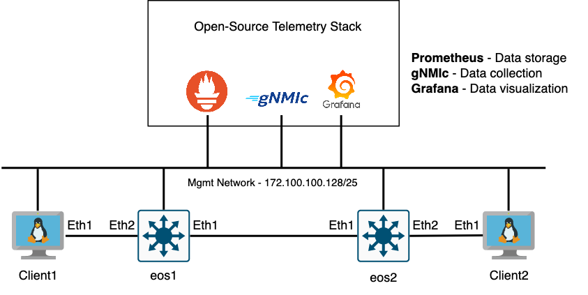
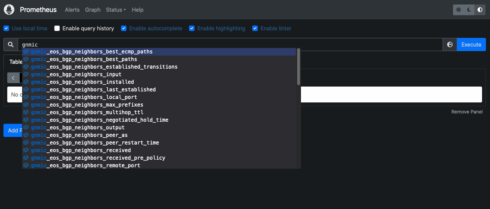
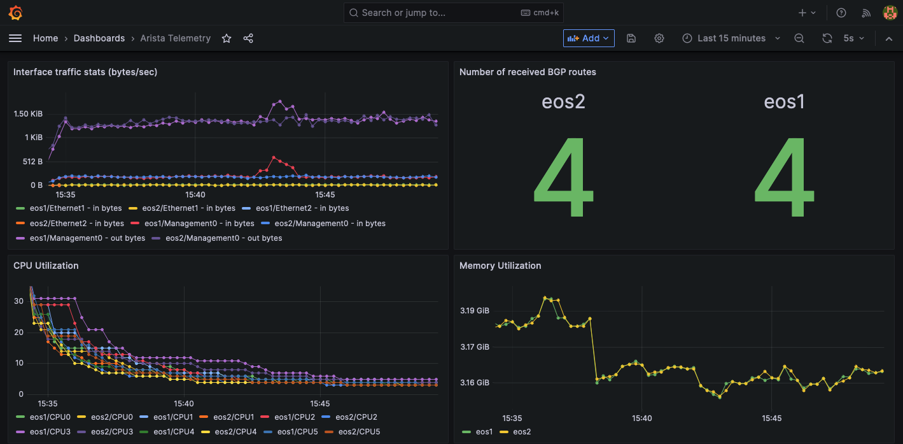

# Arista EOS Telemetry Lab (ft. containerlab)

This repository is heavily based on the amazing Nokia SR Linux Telemetry Lab from SRL Labs (https://github.com/srl-labs/srl-telemetry-lab). I was amazed at their demo and how easy it was to spin up multiple containerized network devices ***AND*** an open-source telemetry stack with one command (using containerlab)! I highly recommend checking out their lab, as it is a true inspiration for this lab. The license and copyright of that project has been retained in this project due to the reusability of some code (mostly the telemetry stack configs), and ultimately the idea for building out the lab.

***NOTE: There is an assumption containerlab is installed and you have gone through the [containerlab docs](https://containerlab.dev/). If not, I recommend doing so before spinning up this lab.***

## Topology


Before we get started, let's talk about the lab. There are a couple cEOS devices, Linux clients, and an open-source telemetry stack made up of Prometheus, gNMIc, and Grafana.

### Networking
There's an eBGP peering between two cEOS devices (eos1 and eos2) that are redistributing all connected routes. The reason we are redistributing all connected routes is for the telemetry collection. The Client devices are connected to the cEOS devices via an L2 access port that is configured in a VLAN (eos1 = VLAN17 / eos2 = VLAN18). Both cEOS devices have an L3 SVI configured for the respective Client VLAN. Lastly, each cEOS device has a Loopback interface configured.

### Tooling

#### gNMIc

gNMIc is a tool used to collect and transform gNMI telemetry data. You can see its configuration in the `configs` folder - `configs/gnmic-config.yml` For more information, check out their [website](https://gnmic.openconfig.net/).

#### Prometheus

Prometheus is used to store data from gNMIc. You can access the tool locally via `localhost:9090`. Browse around and check out the data coming from gNMIc using the graph menu. Begin typing 'gnmic' and you should see an autocomplete dropdown with all the different metrics that are available.



#### Grafana

The last part of the telemetry stack is Grafana. It is used to visualize the data stored in a time-series database. In this case, we are querying Prometheus, but it could be InfluxDB or any other time-series DB. There are many possibilities to the dashboards you can make in Grafana, but I included one "out-of-the-box" called Arista Telemetry that will help get your creative juices flowing. To view the dashboard, you may need to login. Check out the Credentials section for more info on how to login. Here's a screenshot of the Arista Telemetry dashboard:



You can see we are monitoring interface statistics, CPU/memory utilization, and even the number of received BGP routes (hence why we are redistributing connected routes)!

Hopefully this got you excited! Now let's jump in and see how we can getting started!

## Getting Started

As you can see from the topology diagram, we have a couple Arista cEOS devices deployed. In order to deploy this containerlab topology, you must have a local Docker image of Arista cEOS 4.28.4M, or any cEOS other version you wish to deploy. To download the image, you'll need to create an Arista account and login to Arista's [Software Download page](https://www.arista.com/en/support/software-download). Once logged in, download the cEOS .tar.xz/.tar file from Arista's support website and use `docker load` or `docker import` to load the image into your local Docker instance on your computer. Here's an example of using docker import (assuming you've downloaded the 4.28.4M image):

```
cat cEOS-lab-4.28.4M.tar | docker import - ceos:4.28.4M
```

Verify the docker image is in your local image repository by using the `docker images <image_name>` command. You should see similar output if all goes well:

```
REPOSITORY   TAG       IMAGE ID       CREATED        SIZE
ceos         4.28.4M   79b603907b0f   8 months ago   1.89GB
```

Once you have a local cEOS docker image, the rest of the docker images required for the lab are public and will download when we spin up the lab.

**For Mac users**: If you have an Mac (must be Intel-based), you'll need to run the included shell script (`boot_clab_mac.sh`) to launch containerlab inside of a Docker container before booting up the lab. The script should put you into the container, where you can begin running your containerlab commands. For more information on this and the script, check out the [containerlab installation docs](https://containerlab.dev/install/#mac-os).

### Credentials

Since this is a lab environment, I kept the credentials simple. All credentials to login to each network device and tool is `admin`/`admin` for the username and password. If `admin` does not work, I recommend searching for the default credentials for that particular tool. Please feel free to change them to something more secure.

### Running the Lab

This is the best part of the containerlab experience. The entire containerlab topology is defined in `mdt.clab.yml`. You'll see 2 x cEOS devices, 2 x Linux clients, and the telemetry stack (Prometheus, gNMIc, and Grafana) all defined in the one file. With one command, the entire lab will be built:

```
containerlab deploy -t mdt.clab.yml
```

After running the command, you should see similar output if all goes well:
```
INFO[0000] Containerlab v0.41.0 started
INFO[0000] Parsing & checking topology file: mdt.clab.yml
WARN[0000] Unable to init module loader: stat /lib/modules/5.15.49-linuxkit-pr/modules.dep: no such file or directory. Skipping...
INFO[0000] Creating lab directory: /Users/danwade/temp/clab-telemetry-lab/clab-mdt-demo
INFO[0000] Creating docker network: Name="custom-mgmt-net", IPv4Subnet="172.100.100.0/24", IPv6Subnet="", MTU="1500"
INFO[0000] Creating container: "prometheus"
INFO[0000] Creating container: "gnmic"
INFO[0000] Creating container: "grafana"
INFO[0000] Creating container: "client2"
INFO[0000] Creating container: "client1"
INFO[0001] Creating container: "eos2"
INFO[0001] Creating container: "eos1"
INFO[0001] Creating virtual wire: eos1:eth2 <--> client1:eth1
INFO[0001] Creating virtual wire: eos2:eth2 <--> client2:eth1
INFO[0001] Creating virtual wire: eos1:eth1 <--> eos2:eth1
INFO[0002] Running postdeploy actions for Arista cEOS 'eos1' node
INFO[0002] Running postdeploy actions for Arista cEOS 'eos2' node
INFO[0046] Adding containerlab host entries to /etc/hosts file
INFO[0047] Executed command "ip address add 172.17.0.2/24 dev eth1" on the node "client1". stdout:
INFO[0047] Executed command "ip route add 172.18.0.0/24 via 172.17.0.1" on the node "client1". stdout:
INFO[0047] Executed command "iperf3 -s -p 5201 -D > iperf3.log" on the node "client1". stdout:
INFO[0047] Executed command "ip address add 172.18.0.2/24 dev eth1" on the node "client2". stdout:
INFO[0047] Executed command "ip route add 172.17.0.0/24 via 172.18.0.1" on the node "client2". stdout:
INFO[0047] Executed command "route add default gw 172.18.0.1 eth1" on the node "client2". stdout:
INFO[0047] 🎉 New containerlab version 0.44.0 is available! Release notes: https://containerlab.dev/rn/0.44/
Run 'containerlab version upgrade' to upgrade or go check other installation options at https://containerlab.dev/install/
+---+------------+--------------+---------------------------------+-------+---------+--------------------+--------------+
| # |    Name    | Container ID |              Image              | Kind  |  State  |    IPv4 Address    | IPv6 Address |
+---+------------+--------------+---------------------------------+-------+---------+--------------------+--------------+
| 1 | client1    | b6f6a31d9a25 | ghcr.io/hellt/network-multitool | linux | running | 172.100.100.200/24 | N/A          |
| 2 | client2    | dd4bb4edba46 | ghcr.io/hellt/network-multitool | linux | running | 172.100.100.201/24 | N/A          |
| 3 | eos1       | fcc404279da1 | ceos:4.28.4M                    | ceos  | running | 172.100.100.130/24 | N/A          |
| 4 | eos2       | a94f08e3f536 | ceos:4.28.4M                    | ceos  | running | 172.100.100.129/24 | N/A          |
| 5 | gnmic      | 77108f3d6a57 | ghcr.io/openconfig/gnmic:0.30.0 | linux | running | 172.100.100.150/24 | N/A          |
| 6 | grafana    | 4e3b044a1870 | grafana/grafana:9.5.2           | linux | running | 172.100.100.152/24 | N/A          |
| 7 | prometheus | 9b1b3d890e1f | prom/prometheus:v2.37.8         | linux | running | 172.100.100.151/24 | N/A          |
+---+------------+--------------+---------------------------------+-------+---------+--------------------+--------------+
```

## Device/Tool Access

You'll notice the neatly formatted table at the end of the previous output. Those are all the Docker containers running locally on your machine. You can view the containers using `containerlab` commands or with traditional `docker` commands. With that being said, containerlab adds one more advantage to accessing your devices. During post-deployment, containerlab adds your containerlab devices to `/etc/hosts` so that you can connect to them using the container's hostname. For example, we can connect to the eos1 device via `ssh admin@eos1` instead of needing the IP address. Check out the logs I'm referring to:

```
INFO[0002] Running postdeploy actions for Arista cEOS 'eos1' node
INFO[0002] Running postdeploy actions for Arista cEOS 'eos2' node
INFO[0046] Adding containerlab host entries to /etc/hosts file
```

If you just want to access the container as you would any other Docker container, you can also use `docker exec`. I recommend using `docker exec` when accessing the client devices' (client1/client2) bash shell.

Here's a breakdown of how I recommend connecting to each device/tool.

### cEOS Devices

SSH to the devices. Example: `ssh admin@eos1`

### Client devices

Use the `docker exec` command to access the bash shell. Example: `docker exec -it client1 bash`


### gNMIc

Via the command line on each Client device: `gnmic <option> <flag>`

### Prometheus

Web UI: `localhost:9090`

### Grafana

Web UI: `localhost:3000`

## Traffic Generation

In Grafana, there is a dashboard panel for interface statistics. In order to make this panel entertaining, iperf is installed and running on both Client devices. Client 1 is running the iperf server, while Client 2 acts as the iperf client. In order to run an iperf test between Client 1 and 2, you must initiate the iperf test from Client 2. Luckily, there's a shell script saved at `/config/iperf.sh` on Client 2 that takes care of that for you. To begin the test, get into the bash of Client 2 using `docker exec` and execute the shell script.

```
# Places you in the bash shell of the 'client2' container
docker exec -it client2 bash

# Once in the shell, run the script
bash-5.0# ./config/iperf.sh
```

This will kick off the iperf test and you should begin seeing tables of data taking over the terminal. These tables shows the interval, bitrate, and other details about the ongoing iperf test. To stop the test, kill the iperf process by typing `pkill iperf`. You will not see what you're typing, as the iperf tests continue to run in the foreground, but as long as you typed it correctly, you'll see a message that says `iperf3: interrupt - the client has terminated` in the terminal after typing the command and pressing enter.

## Lab Teardown

Just as we deployed the lab with one command, we can destroy the lab with one command: `clab destroy --cleanup`

```
clab destroy --cleanup
INFO[0000] Parsing & checking topology file: mdt.clab.yml 
INFO[0000] Destroying lab: mdt-demo                     
INFO[0000] Removed container: client2                   
INFO[0000] Removed container: prometheus                
INFO[0000] Removed container: gnmic                     
INFO[0000] Removed container: grafana                   
INFO[0000] Removed container: client1                   
INFO[0000] Removed container: eos2                      
INFO[0000] Removed container: eos1                      
INFO[0000] Removing containerlab host entries from /etc/hosts file
```

*If you'd like to keep a backup of the lab artifacts (configs, certificates/keys, etc.), then simply remove the `--cleanup` flag.*

Just like that - it's like nothing ever happened! Pretty crazy to think about when you had two network devices and an entire telemetry stack deployed on your local PC! Thank you containerlab! 🎉

## Contribution

This code was built for labbing purposes to showcase the different pieces that make up a streaming telemetry solution using Arista devices, but it could be used as a proof-of-concept (POC) for a larger deployment. If you have any suggestions that would improve the lab (additional metrics, dashboards, etc.), please feel open a pull request with your changes!

## Feedback

If you have any questions or would like to provide further feedback, please feel free to message me or open an issue. Thanks!